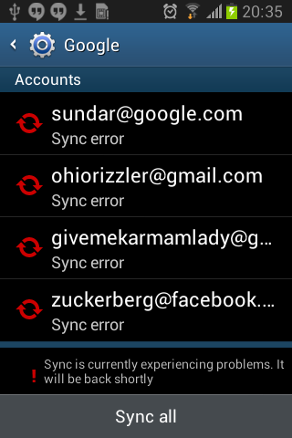

# GMSEmulator

Server emulator for old Google Mobile Services APIs (2011-2016)

# Running

Run `python3 app.py`, Make sure you installed the dependencies in requirements.txt

Finally run `mitmproxy --showhost --set tls_version_client_min=SSL3 --set ciphers_client=DEFAULT@SECLEVEL=0 -s mitmproxy.py` in the repository directory, Make sure you have mitmproxy installed to do this.

## TODO

[X] Working Login

[] Google Play Store